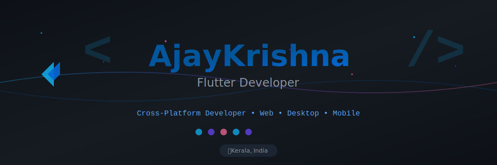

<!-- Banner at the very top -->

  

<h1 align="center">Hey there 👋, I'm Ajay Krishna</h1>
<h3 align="center">Flutter Frontend Developer | Real-Time Systems Enthusiast</h3>

  

---

### 👨‍💻 About Me

I'm a **Flutter Frontend Developer** working at a startup, specializing in **real-time and UI-intensive applications**. My focus is on building **production-grade apps** rather than demo projects.

Currently based in **Kerala, India** 🌴, I work with live data streams, real-time communications, and performance-critical Flutter applications.

---

### 🚀 What I'm Working On

- 💼 **Flutter Frontend Developer** at a startup
- 📡 Building real-time applications with socket-based communication
- 🎯 Creating production-ready Flutter applications across multiple platforms
- ⚡ Performance optimization and efficient UI implementations

---

### 💼 Professional Experience

**Flutter Frontend Developer** | Startup  
- Developing cross-platform applications (Mobile, Web, Desktop)
- Working with real-time data streams and socket communication
- Building complex, performance-focused user interfaces
- Production app development and maintenance

---

### 🛠️ Technical Skills

**Primary Stack:**
- **Flutter & Dart** - Cross-platform development (Mobile, Web, Desktop)
- **Real-time Data Handling** - TCP sockets, WebSockets
- **UI/UX Implementation** - Complex, performance-focused interfaces
- **Firebase** - Backend integration and real-time databases
- **Git & GitHub** - Version control and collaboration

**Systems & Tools:**
- Linux (Basic usage)
- SQLite & Hive (Local databases)
- C Programming
- Map APIs and geolocation services

---

### 📚 Currently Learning

Expanding my skillset into systems programming and core development:

- **C++** - For performance-critical applications
- **Qt** - Desktop application development
- **Computer Science Fundamentals** - OOP, memory management, DSA basics

---

### 🎓 Education

**Bachelor of Computer Applications (BCA)** - 2023

---

### 🎯 Interests & Focus Areas

- 🛸 **Drones & Autonomous Systems**
- ⚙️ **Systems Programming**
- 🔧 **Performance Optimization**
- 💾 **Low-level Computing & Memory Management**

---

### 📫 Let's Connect

**Email:** ajaykrishna9872@gmail.com

---

### 🧰 Languages and Tools

---

### 📊 GitHub Stats

  

  

  

---

  <i>💡 "Building production-grade applications with a focus on performance and reliability"</i>

